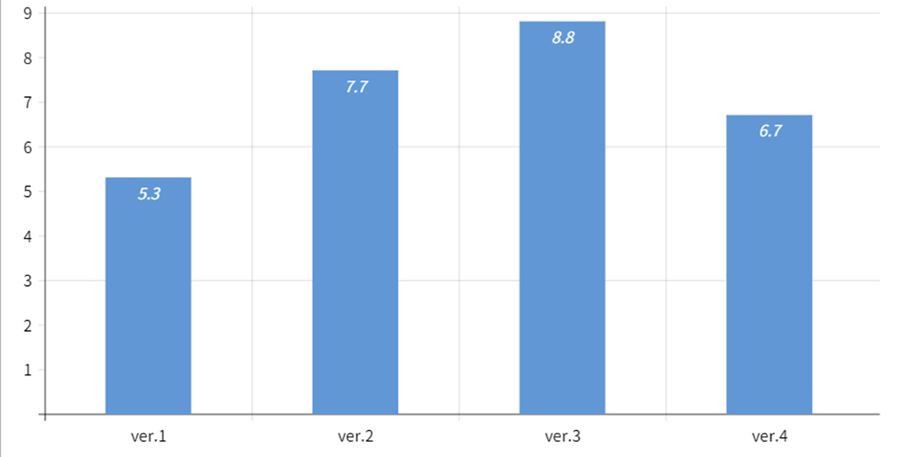

# VR-Drum

## Overview

This project involves implementing a virtual drum system and comparing the levels of immersion when users experience different combinations of sensory inputs.
I presented 10 users with 4 different levels of immersion and measured their immersion on a scale from 1 to 10.

## Tech Stack
Unity 2022.3  
Meta Quest3  
Oculus Interacton SDK  

## Usage

- You can play drum as if it's a real thing.
- When you hit each part of the drum, you are going to feel different vibration and sound.
- An animation effect is triggered every time the user hits the drum.

## Results, Evaluation
I presented 10 users with 4 different levels of immersion and measured their immersion on a scale from 1 to 10 and get averages of each levels.

- Ver1: Visual + Auditory (only sound provided when hitting)
- Ver2: Visual + Auditory + Tactile (sound + vibration upon impact)
- Ver3: Visual + Auditory + Tactile (Animation effects added)
- Ver4: Visual + Auditory + Tactile (Added animation + sound pressure vibration effect)

Ver.1-3 offered a more diverse sensory experience, increasing immersion. However, Ver.4 attempted to enhance the impact (sound pressure) through vibration, but user reviews declined significantly.
Sound pressure is a sensation felt throughout the entire body, and controller vibration not only failed to adequately convey the experience, but also disrupted the vibration experience of existing drum parts.

You can get 3 types sensory inputs while you are playing the drum.
1. Visual information about playing the drum
2. Drum sound, vibration transmitted through the sticks
3. The impact and sound pressure transmitted through the body

Experiences 1 and 2 were fully achievable through the HMD and controllers used in this project, such as the Meta Quest 3, and their provision significantly enhanced user immersion.
However, Experience 3 could only be provided indirectly through animation effects using the HMD and controllers. For this full-body experience, a vibrating chair or large external speakers would be a better approach.
